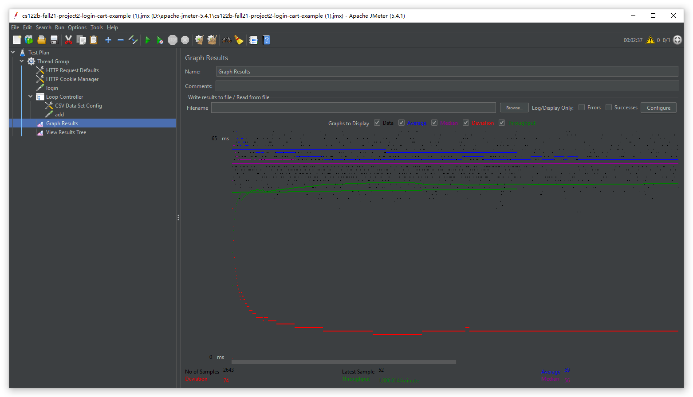
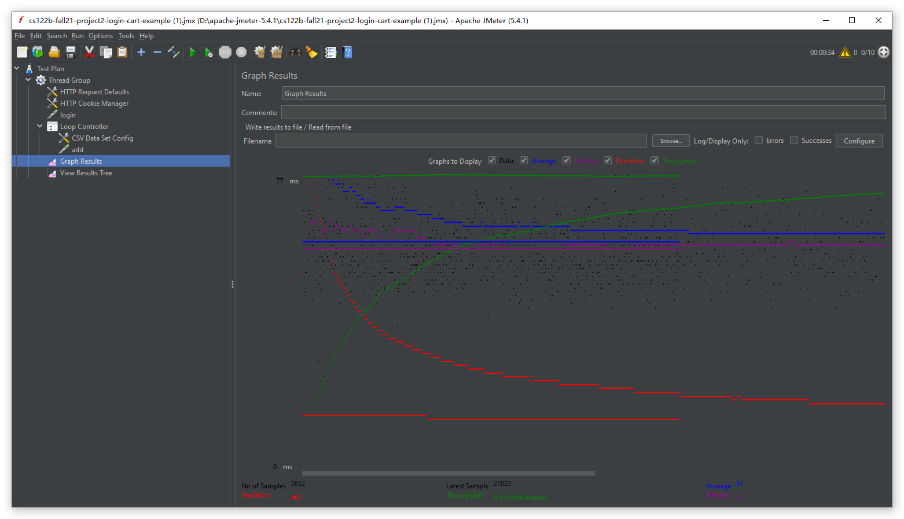
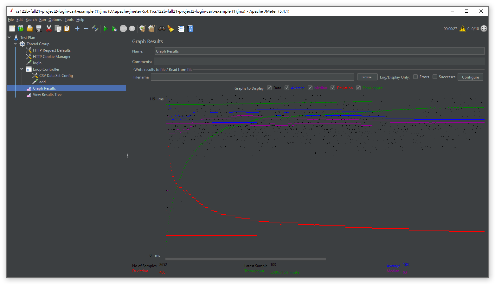
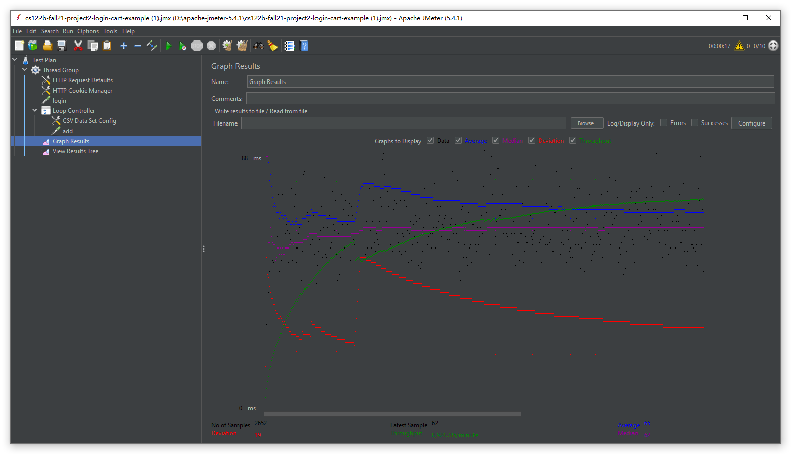
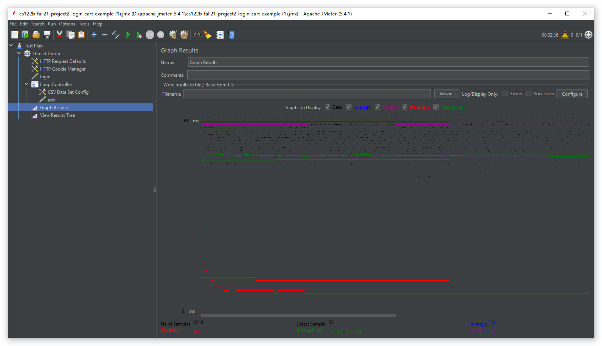
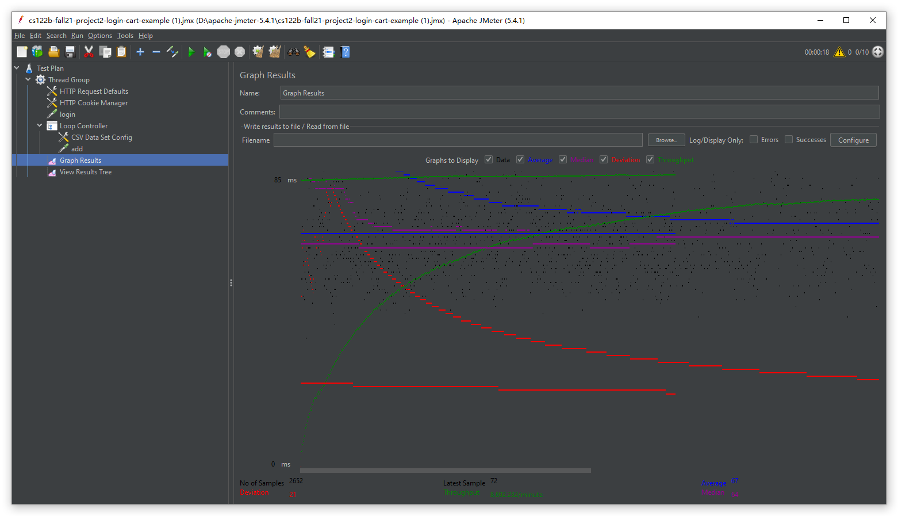

### Note: Commit History users Ubuntu is our AWS Linux User, Chunzhi Xu accidentally push changes without checking the username when debugging on AWS.
- # General
    - #### Team#: **Fall 2021 Team 6** 
    
    - #### Names: Chunzhi Xu & Haoting Ni
    
    - #### Project 5 Video Demo Link: https://youtu.be/FDdgqsXhaRg

    - #### Instruction of deployment:
     
    ```
    - On AWS Server clone the project1
    git clone https://github.com/UCI-Chenli-teaching/cs122b-fall21-team-6.git
    
    - Direct to project folder
    
    cd cs122b-fall21-team-6/Fablix
    
    - Build the war file

    mvn package
  
    - Copy war file to tomcat to deploy
   
    sudo cp ./target/*.war /var/lib/tomcat9/webapps/

    *If you want to make changes to https or sql connection pooling:
     sudo nano /var/lib/tomcat9/webapps/fablix/META-INF/context.xml
     sudo nano /var/lib/tomcat9/webapps/fablix/WEB-INF/web.xml
    ```

    - #### Collaborations and Work Distribution:
     
        
     ```
      - CurtisXuCAD (Chunzhi Xu)
       Build movie list page
       Beautify table
       GitHub setup
       AWS setup
       Create demo
       Bug fixing
       Beautify Login, Main Page, Movie List Page
       Jump Function using session
       Query optimization
       Pagination
       Sorting
       HTTPS
       Password Encryption
       XML Parsing
       Prepared Statedment
       Fixing Query & Statedment
       Android App -- Fablix Mobile
       Fixing Pagination & Sorting for full-text search result
       log Processing script
       JMeter Time Report
       Log files
     ```

     
     ```
     - Silence-silence-silence (Haoting Ni)
       Single Movie Page
       Single Star Page
       Jump Function
       Readme Creation 
       Beautify Pages
       Creat_table.sql
       Main Page 
       Login Page
       Browsing and Search Functionality
       Shopping Cart
       Payment Page
       Place Order
       Confirmation Page
       Add to Cart
       Beautify Shopping Cart, Payment Page, Confirmation Page
       reCAPTCHA
       Prepared Statedment
       Employee Dashboard
       Full-text Search
       Autocomplete
       Connection pooling
       Master/Slave
       Loading balacing
     ```
- # Connection Pooling
    - #### Include the filename/path of all code/configuration files in GitHub of using JDBC Connection Pooling.
        <a href="Fablix/src/PaymentServlet.java">PaymentServlet.java</a>
        <a href="Fablix/src/DashboardServlet.java">DashboardServlet.java</a>
        <a href="Fablix/src/ConfirmationServlet.java">ConfirmationServlet.java</a>
        <a href="Fablix/src/IndexServlet.java">IndexServlet.java</a>
        <a href="Fablix/src/LoginServlet.java">LoginServlet.java</a>
        <a href="Fablix/src/MainServlet.java">MainServlet.java</a>
        <a href="Fablix/src/MoviesServlet.java">MoviesServlet.java</a>
        <a href="Fablix/src/PaymentServlet.java">PaymentServlet.java</a>
        <a href="Fablix/src/rDashboardServlet.java">rDashboardServlet.java</a>
        <a href="Fablix/src/SingleMovieServlet.java">SingleMovieServlet.java</a>
        <a href="Fablix/src/SingleStarServlet.java">SingleStarServlet.java</a>
        <a href="Fablix/WebContent/META-INF/context.xml">context.xml</a>
        <a href="Fablix/WebContent/WEB-INF/web.xml">web.xml</a>

    - #### Explain how Connection Pooling is utilized in the Fabflix code.
    ```
    -In the context.xml file, first define all the database resource you want to use.
    -In the web.xml file, register all the database resource you defined in the context.xml.
    -On top of the servelet file that you want to use to connect to the database, define a datasource object.

     public void init(ServletConfig config) {
            try {
                dataSource = (DataSource) new InitialContext().lookup("java:comp/env/jdbc/nameOfdatasource");
            } catch (NamingException e) {
                e.printStackTrace();
            }
        }
    -use getconnection to connect to databases.
    Connection conn = dataSource.getConnection()
    - The connection will be reused by the clients in this way. The web page will get a connection to the database. When the website finish the actions, the connection will be put back to the connection pool.
    ```
    - #### Explain how Connection Pooling works with two backend SQL.
    ```
    - Since we have create two different datasources in the context.xml file, we could use different datasources depending on the situation.
    - Because there is no restriction on the read operations, we could connect one of the datasource to localhost mysql. So it could connect either one of the backend SQL.
    - And we define another connection to master instance for write operations.
    - The connections will be reused depending on the types of the operations.
    ```

- # Master/Slave
    - #### Include the filename/path of all code/configuration files in GitHub of routing queries to Master/Slave SQL.

    <a href="Fablix/src/PaymentServlet.java">PaymentServlet.java</a>
    <a href="Fablix/src/DashboardServlet.java">DashboardServlet.java</a>
    <a href="Fablix/src/ConfirmationServlet.java">ConfirmationServlet.java</a>
    <a href="Fablix/src/IndexServlet.java">IndexServlet.java</a>
    <a href="Fablix/src/LoginServlet.java">LoginServlet.java</a>
    <a href="Fablix/src/MainServlet.java">MainServlet.java</a>
    <a href="Fablix/src/MoviesServlet.java">MoviesServlet.java</a>
    <a href="Fablix/src/PaymentServlet.java">PaymentServlet.java</a>
    <a href="Fablix/src/rDashboardServlet.java">rDashboardServlet.java</a>
    <a href="Fablix/src/SingleMovieServlet.java">SingleMovieServlet.java</a>
    <a href="Fablix/src/SingleStarServlet.java">SingleStarServlet.java</a>
    <a href="Fablix/WebContent/META-INF/context.xml">context.xml</a>
    <a href="Fablix/WebContent/WEB-INF/web.xml">web.xml</a>
    - #### How read/write requests were routed to Master/Slave SQL?
    <a href="Fablix/src/PaymentServlet.java">PaymentServlet.java</a>
    <a href="Fablix/src/rDashboardServlet.java">rDashboardServlet.java</a>
    These two web pages are the places that we implement write operations to the SQL. Because we could both write and read to master instance. We simply defined a connection to master instance on the top of the file. Every operation comes from these two website will be routed to Master SQL.

    For rest of the websites, all the operations are read. So it does not master whether it is connect to Master or Slave. We simply make it connect to localhost.

- # JMeter TS/TJ Time Logs
    - #### Move to the root of the project
    ```
    cd cs122b-fall21-team-6/
    ```
    - #### The log file show be generated at:
    ```
    /var/lib/tomcat9/webapps/fablix/logTSTJ.txt
    ```
    - #### Run the logParser.py:
    ```
    sudo python3 logParser.py
    ```

- # JMeter TS/TJ Time Measurement Report

| **Single-instance Version Test Plan**          | **Graph Results Screenshot** | **Average Query Time(ms)** | **Average Search Servlet Time(ms)** | **Average JDBC Time(ms)** | **Analysis** |
|------------------------------------------------|------------------------------|----------------------------|-------------------------------------|---------------------------|--------------|
| Case 1: HTTP/1 thread                          |    | 59ms                         | 4.09068ms                                  | 2.99289ms                        | It has the fastest query time, Search Servlet Time and JDBC Time. Because the case 1 does not have much stress. Only 1 thread tried to connect to the website.           |
| Case 2: HTTP/10 threads                        |    | 67ms                         | 6.80593ms                                  | 5.52842ms                        | Compared with case 1, using 10 threas accessing the website will bring lot of stress. Which all the response time increase.           |
| Case 3: HTTPS/10 threads                       |    | 103ms                         | 6.64095ms                                  | 5.08402ms                        | Compared with case2,  request will be directed to https port, while downloading data, time sending request and receiving reuqest increase. Therefore, communication time increases.           |
| Case 4: HTTP/10 threads/No connection pooling  |    | 68ms                          | 12.80584ms                                  | 8.46313ms                        | Mysql will not reused the connection. Therefore, query time won't increase. But Average Search Servlet Time and Average JDBC Time increase dramatically compared with case 2 and case 3.           |

| **Scaled Version Test Plan**                   | **Graph Results Screenshot** | **Average Query Time(ms)** | **Average Search Servlet Time(ms)** | **Average JDBC Time(ms)** | **Analysis** |
|------------------------------------------------|------------------------------|----------------------------|-------------------------------------|---------------------------|--------------|
| Case 1: HTTP/1 thread                          |    | 57ms                         | 3.88258ms                                  | 2.92332ms                        | There is no big difference between the scaled version of case1 and single instance of case 1. Because they only have 1 user coming through.            |
| Case 2: HTTP/10 threads                        |    | 67ms                         | 7.77358ms                                  | 5.01001ms                        | Because the scaled version could handle requests concurrently. The scaled version of case 2  have improved response time compared with case 1 because of the load balancer.            |
| Case 3: HTTP/10 threads/No connection pooling  |    | 65ms                         | 9.24853ms                                  | 6.70511ms                        | Connection creation and close to database will slow down the response time. Therefore, it is improved compared with single instance but worse compared with scaled version of case 2.     


## Substring matching design
- To search Title, Director, Stars:
 ```
 Pattern: LIKE %ABC%  (ABC is key word enter in the text bar)
 Any movies contain all key words entered in the text bars.
 
 If title has key word A, director has key word B, stars has key word C:
 Mysql script: where movie.title Like %A% and movie.director LIKE %B% and stars.name LIKE %C%
 ```
## Prepared Statement
We use Prepared Statement mainly in MoviesServlet.java, every url parameter and user input will finally put into a prepared statement which protect the database from sql attack.
<a href="Fablix/src/PaymentServlet.java">PaymentServlet.java</a>

Others:
<a href="Fablix/src/DashboardServlet.java">DashboardServlet.java</a>
<a href="Fablix/src/ConfirmationServlet.java">ConfirmationServlet.java</a>
<a href="Fablix/src/IndexServlet.java">IndexServlet.java</a>
<a href="Fablix/src/LoginServlet.java">LoginServlet.java</a>
<a href="Fablix/src/MoviesServlet.java">MoviesServlet.java</a>
<a href="Fablix/src/rDashboardServlet.java">rDashboardServlet.java</a>
<a href="Fablix/src/SingleMovieServlet.java">SingleMovieServlet.java</a>
<a href="Fablix/src/SingleStarServlet.java">SingleStarServlet.java</a>
## Two parsing time optimization strategies
1. I load the original data we need from database to help use check if the new data is already exist or not immediately when we finish reading each element. Thus, we need less query when we process the data.

2. I use the LOAD DATA LOCAL INFILE feature to load everything we need to add to the database. I first create several csv file for different tables in database and store the new data into these csv file. After creating the csv file, I only need to use LOAD DATA LOCAL INFILE feature to load the data at once, which hugely improve the parsing time.

## Inconsistent data report

[Inconsistent Report](Fablix/xml_parser/inconsistency_report.txt)


